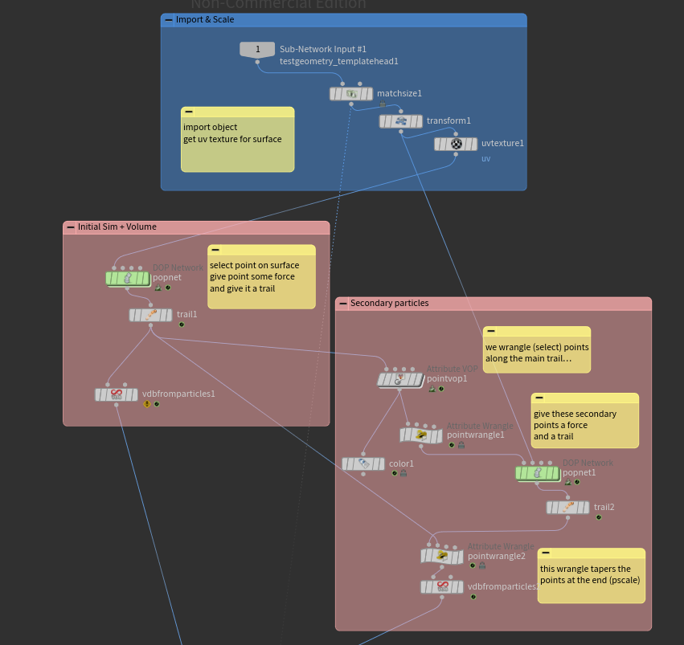

---


---

## Houdini File

**This is the link to the Houdini file**

[[fungus.hipnc|Open Houdini File]]

---

## 1) Summary

**What is the final result? What does this produce?**

This system procedurally generates organic, branching fungal growth over any arbitrary 3D mesh using particle simulations and VDB volumetric meshing. It is packaged as a scale-agnostic Houdini Digital Asset (HDA) that outputs a UV-mapped Static Mesh ready for game engines.

---

## 2) Context (Where + Why)

**Where was it used? **

  As an interactive environment art tool deployed within Unreal Engine 5 via the Houdini Engine plugin.

**What problem did it solve? **

  Manually designing organic growths on highly detailed meshes can be time consuming. Procedural generation also allows for quick variation whilst still being artist-driven.

**Key goal (visual, technical, etc.**

  Provide a reusable artist-driven tool that generates organic fungus like growths. Physical behaviour should remain consistent on any size or complexity of mesh.

---

## 3) Setup (Make it reproducible)

**Software + version:**

Houdini 21.0, Unreal Engine 5.6

**Key dependencies (external tools, plugins, HDAs):**

Houdini Engine for Unreal/Unity.

**How to run / use:**

1. Import the '.hdalc' file into Unreal Engine using Houdini Engine/Session Sync.
2. Drag the HDA into the level and navigate to the Details Panel.
3. Under "Houdini Inputs", change Input 1 to "Geometry Input" and select any Static Mesh.
4. Adjust the parameters (Branching Threshold, Voxel Size, etc).
5. Scrub the "Growth Amount" (Timeshift) slider to freeze the simulation at the desired frame, generating the final static mesh.
---

## 4) Network or Process (Overview)

**How the network or process works at a high level**




1. **Scale Normalization:** The input mesh (`Sub-Network Input 1`) is passed through a `Match Size` node. This squishes the target to a 1x1x1 bounding box and caches the original scale/position into a detail attribute called `xform`. This ensures forces behave identically on any prop.
2. **Surface Adhesion:** Particles are forced to snap to the mesh surface at the end of every frame using a Point Wrangle inside the POP Network.
3. **Dual-Tier Simulation:** A primary POP network spawns the main trail. As it travels, it calculates a gradient (`@grad`). A Point Wrangle evaluates this gradient to spawn secondary branching paths from an `emit` group.
4. **VDB Meshing:** The point trails are converted to VDBs, using the particle's `@pscale` attribute to automatically taper the thickness of the branches. 
5. **Output Restoration:** VDB conversion destroys detail attributes, so an `Attribute Copy` node restores the `xform` scale+transform data. A `Timeshift` node freezes the simulation frame, and a final `Match Size` restores the original bounding box scale before outputting to the engine.

---

## 5) Improvements
 
Could specify exact point on mesh where fungus should generate from as secondary Unreal input.
Could also output a gradient attribute from root to tips of tendrils, allowing artists to blend between multiple materials on the final output.
Sending each frame to Unreal as a growth animation? Might need a custom script/plug-in?

---

## Folder Structure (Important)

Place your `.md`, Houdini project file, and any assets in the same folder.

**Structure**
 
```
/project_folder
    technique.md
    project.hipnc
    /geo/
        object.obj, etc.
    /tex/
        texture.jpg, etc.
```
**Compressed file must not exceed 100 MB**

---
## Folder name format (Important)

[main_technique]_[key_feature]

Examples:
- flip_viscosity_gradient
- vellum_softbody_wobble
- pyro_temperature_shader
---

## File Paths (Important)

**Use `$HIP` inside the Houdini file for all file references:**

- `$HIP/geo/object.obj`
- `$HIP/tex/texture.jpg`

**Do not use:**
- Absolute paths (e.g. `/Users/...`)

**All files must work when moved to another computer. Check by copying your folder to a different location and reopening the project to ensure all assets and images load correctly. Make sure the Houdini file opens from the link.**

---